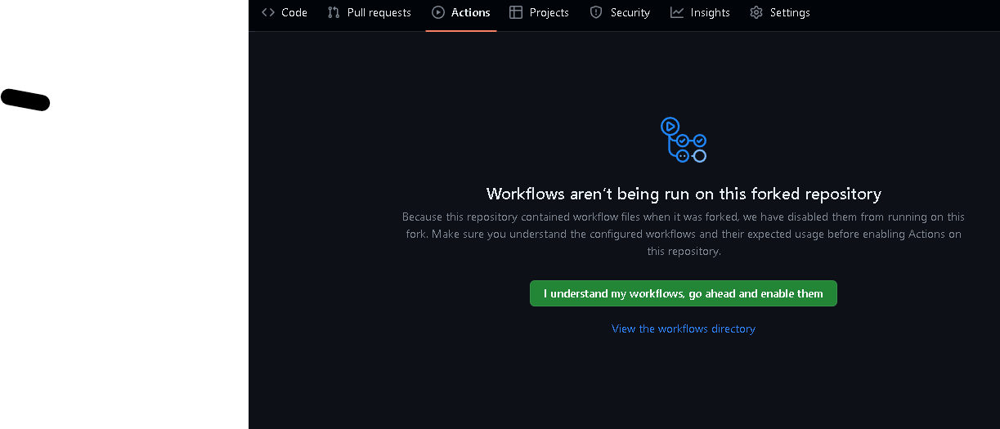
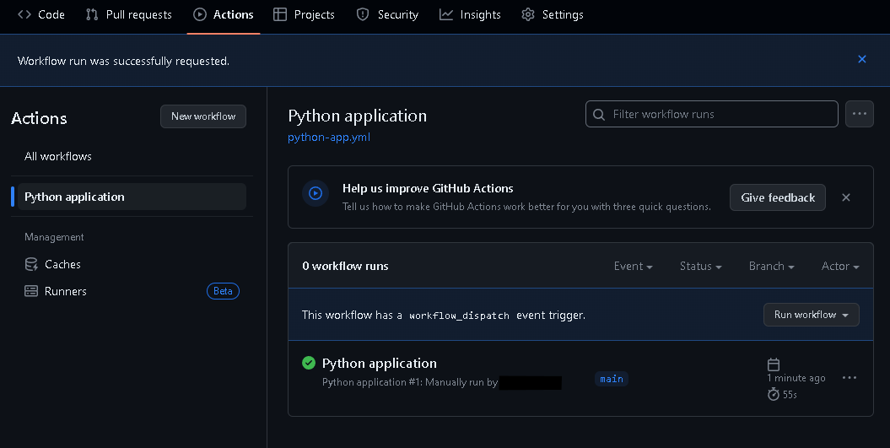

# Air Quality Data Reporting System


This project is the Week 5 assignment of the Application course. This application: 

1. pulls air quality data from a public API,
1. stores the data in a database,
1. provides a web front end where a user can request an analysis of the data,
1. performs said analysis asynchronously,
1. presents the results to the user.

The end result looks like this:


## Table of Contents
- [Rubric coverage](#rubric-coverage)
- [Note](#note)
- [Setup](#setup)
    - [Installation](#installation)
    - [Building](#building)
- [Metrics](#metrics)
- [Usage](#usage)
- [Design documentation](#design-documentation)
- [Internal API documentation](#internal-api-documentation)
- [File explanations](#file-explanations)
- [Data source](#data-source)

## Rubric coverage
- **Web application basic form, reporting**: The web application provides a form where the user can enter a time period and request a statistical analysis of the data collected during that time period. The web application also provides a page where the user can view the results of the analysis.
- **Data collection**: The web application collects data from a public REST API that provides air quality measurements.
- **Data analyzer**: Per user request, the web application provides summary statistics of the data collected.
- **Unit tests**: Unit tests are included in the `tests/test_fetch_data.py` file.
- **Data persistence, any data store**: The web application stores the data collected in a MySQL database.
- **Rest collaboration internal or API endpoint**: The web application uses an internal REST API to request and retrieve reports. 
- **Product environment**: The web application is deployed on Heroku.
- **Integration tests**: Integration tests are also included in the `tests/test_fetch_data.py` file. Refer to the `test_collect_integrated` function.
- **Using mock objects or any test doubles**: The `test_collect_and_store_fake_data` function in the `tests/test_fetch_data.py` script contains a canned answer to the calls made to the public API. There are various kinds of test doubles; according to this [blog entry of Martin Fowler's](https://martinfowler.com/bliki/TestDouble.html), this type of test double is called a "stub".
- **Continuous integration**: The project uses GitHub Actions for continuous integration. The workflow is defined in the `.github/workflows/python-app.yml` file.
- **Production monitoring instrumenting**: Multiple tools are used to monitor the health of the components of this application. The project is instrumented with StatsD and uses Graphite to monitor the application. Refer to the Metrics section in this README for details. 
- **Event collaboration messaging**: The web application uses RabbitMQ and Celery to exchange messages with the data analysis component of the system.
- **Continuous delivery**: The project uses Heroku for continuous delivery.

## Note
This README walks you through setting up this application as if you acquired the source code from me and were operating as a system admin to install it. I host this app at [https://cs-5028-wk5-c35c51ba441a.herokuapp.com/](https://cs-5028-wk5-c35c51ba441a.herokuapp.com/) if you would like to see the final product. 

## Setup 

### Installation

This project was gradually developed - deployment was first local, and later deployment to Heroku was added. The instructions below are for the Heroku deployment. However, some files and dependencies that are only required for local deployment are still present in the repository.

1. Fork my repository [https://github.com/dustin-jacobsen-colorado-edu/cs-5028-wk-5](https://github.com/dustin-jacobsen-colorado-edu/cs-5028-wk-5) to your own GitHub account.
1. Trust our build action as shown here:

1. Run the build action once to nudge GitHub into finding it. It'll take a minute or so to complete:

1. Configure your main branch as shown in the image below:

1. Link your fork to your own Heroku account. There are many guides available online. I used https://medium.com/featurepreneur/how-to-connect-github-to-heroku-be6ff27419d3
1. Under the Resources tab in Heroku dashboard, enable these 3 dynos under Basic Dynos, and add these 3 add-ons under Add-ons:

1. For the hosted Graphite add-on, enter its management interface and find the StatsD add-on for it. Add that. Take note of the URL and API key.

1. Configure the configuration variables of StatsD in Heroku's settings page -> config vars. Most of these config vars will be automatically populated by the addons, but you need to add the StatsD configuration variables.

1. Under the Deploy tab in Heroku dashboard, we can see what these settings are at this point. Come back to these settings after you have succeeded with a manual deployment.


### Building

We have a build process that depends on GitHub Actions. If you make a pull request against the main branch, it will run. To test that our process is building in your setup before you make any further changes, you can manually run the build process like so:


Incidentally, the results of the unit and integration tests are included in the results of a build.


If the build finishes successfully on GitHub, we move forward to trying it out on Heroku.

From the Deploy tab, manually deploy using the main branch.

At this point, even if the steps above are successful, I still personally find it worthwhile to check the log for all 3 Heroku dynos, in order to make sure there are no obvious problems at startup. 

## Checkpoint
At this point, the application is up and running. An end user (see the Usage section below) is actually able to request a data analysis by now. But we will set up the monitoring services before we move forward to that part. 

## Metrics

Before we get into the metrics, I recommend first checking the log for the `api_polling_worker` dyno. There ought to be no data, till that has written at least once.

TODO: check line numbers's
We provide custom StatsD metrics for [the responsiveness of the air quality API we're polling](https://github.com/dustin-jacobsen-colorado-edu/cs-5028-wk-5/blob/854bbe43f44c258028d5d52373fbc57077d33fcc/src/fetch_data.py#L60-L63), for [our own statistical calculations](https://github.com/dustin-jacobsen-colorado-edu/cs-5028-wk-5/blob/cbb64f58b7ce0262a1917f48981da6491ace58ec/src/analyzer.py#L79-L81), as well as general usage statistics. Flask also provides some standard StatsD metrics. Each of the add-on services has its own built-in metrics. This section aims to help you find all of these.

### JawsDB

JawsDB provides just basic service health information. You can get here by clicking "JawsDB MySQL" in the Heroku's Resources tab:


### RabbitMQ
RabbitMQ metrics are offered by the CloudAMQP add-on: Heroku dashboard -> Resources tab -> Add-ons -> CloudAMQP -> RabbitMQ Manager (big green button).

The most informative stats about our Celery queue can be found at: Queues and Streams -> celery (find it in the table).

You of course won't see much data if you haven't performed much activity, and you may need to adjust the window from the default of "Last minute."


### Graphite
Graphite is where you can find our custom metrics, our standard StatsD metrics, and also Graphite's own metrics.

You can find these from: Heroku dashboard -> Resources tab -> Add-ons -> Hosted Graphite -> Dashboards -> Graphite

Since some of these are custom metrics, they won't be on any dashboard by default, and you'll need to add them individually. The easiest way to do this is to enable a visual interface by selecting Dashboard -> Configure UI -> Navigation Mode -> Tree (left nav). Extend the tree on the left and click metrics to add them to the dashboard. See the below screenshot for some likely relevant metrics.

To help make the data more apparent, I suggest zooming into a small window of time (2h or so) and perhaps choosing area charts since the dots are so scarce that they can be easy to overlook otherwise.


## Usage
From the end user's perspective, the application presents itself as a single page web application. The entry point is the "Open app" button on the Overview tab in Heroku. 

The data source publishes new air quality measurements every 30 minutes. They only offer one data point a time - their most recently available data. I set up the system so one measurement is immediately retrieved from the data source when the application starts, but the next one will come after a while. So after finishing the setup, you need to let it run for at least one hour, to guarantee that it accumulates at least two measurements. 

You can enter the app via the abovementioned entry point, and then request a report by entering a time period on the web page. 

The form validates your input: the time period entries need to be on the half hour or full hour (there is a prompt). I unfortunately have not found a way to limit the datetime dropdown to only show half/full hours. 

Entering the time period may seem tricky due to time differences and data availability. Let me give you an example:

I'm writing this README at 11:15 AM MDT. At this moment, the available measurement corresponds to the half-hour window from 11:00 AM to 11:30 AM MDT. However, the source data is in UTC time, which means this window corresponds to 17:00 to 17:30 UTC.

Instructions:

Choose a Time Window: To get a report, your selected time period needs to cover this window. For example, if you enter "From 06/23/2024 06:00 PM" (please ensure it's exactly 6:00 PM, see the validation above) "To 06/25/2024 07:00 PM," you will receive a report.

Report Contents: This report will include at least the mean and median (when only one measurement is available), with the variance and standard deviation showing as NaN. If the application has enough time to gather more measurements, it will also include the variance and standard deviation.

In summary, make sure your selected time period aligns with the measurement window, and you'll receive a report with relevant statistics.

## Design documentation

The below sequence diagram depicts our four applications as *controls*. Three of those are our Heroku dynos; the fourth is a JavaScript application running on the user's browser.

The user and the four controls exchange data through a series of barriers. In some cases, the data exchange is through RESTful APIs.


Please forgive the oversimplification - I was hitting the limits of the free plan for the UML tool.

## Internal API documentation

The only resource is the `/report` resource which supports GET and POST1.

`GET /report/<id>`
- returns a json object of the form:
```
"report": {
    "attr": {
        "id": string,
        "from_dt": string,
        "to_dt": string,
        "formula": "CO|NO|O3|FN|NO2|PM10",
        "state": "PENDING"|"SUCCESS"|"FAILURE",
        "mean_values": 'NaN' | number,
        "median_values": 'NaN' | number,
        "variance_values": 'NaN' | number,
        "std_deviation_values": 'NaN' | number,
    },
    "rel": {
        "self": string (url)
    }
}
```

Note that some fields may be omitted depending on the state of the report.

`POST /report` 
- expects `from_datetime_str` and `to_datetime_str`,

`POST /report`
- required form paramters `from_dt` and `to_dt`, both in `%Y-%m-%dT%H:%M` format
- required form paramter `formula` one of 'CO', 'NO', 'O3', 'FN', NO2', or 'PM10'
- returns a json object of the same form as the GET request,
```

## File explanations

**`src/`**

- This directory stores the source code of the project. These scripts below are of particular interest.
- `src/fetch_data.py`
- - This script contains the main function that pulls data from the air quality API and stores it in the database. It is regularly invoked by the `src/poller.py` script.
- `src/web.py`
- - This script runs a web server that provides the front end for the user to request statistical analysis of the data.
- `src/analyzer.py`
- - This script contains the main function that performs statistical analysis on the data. It is invoked by the celery worker.

**`src/templates/index.html`**

- As a single page web app, this is the only html template required by the front end.  Further communication between the browser and the web server happens through the REST api.

**`src/assets/`**

- This directory stores the css and javascript files which power the front end.

**`venv/`**

- This directory stores the virtual python environment used by the project.

**`tests/`**

- This directory stores pytest unit and integration tests for the project.

**`config.json`**

- This file stores project configuration settings, such as how often to poll the air quality API.

**`Procfile`**

- This file is used by Heroku to start the web server and other dynos.

**`release.sh`**

- This file is used by Heroku to build a release of the project.

**`runtime.txt`**

- We specify the python interpreter version that we want Heroku to use.

**`requirements.txt`**

- We specify the python dependencies of the project. Heroku installs these libraries.

## Data source
Air quality data is provided by ttps://api-docs.luchtmeetnet.nl
